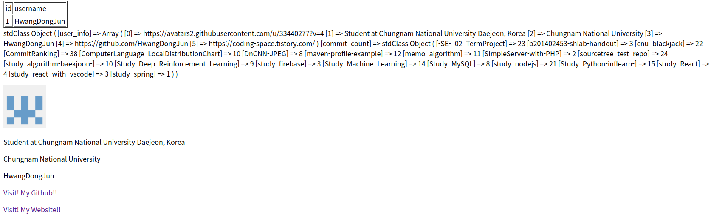

# SimpleServer-with-PHP
PHP의 가장 간단한 문법들을 사용하여 Github의 개인 정보 및 개인의 Repository의 Commit횟수를 가져오는 Server제작 
PHP를 통한 Github 정보를 가져오는 방법에 대해 아주 간단하게 연습을 한 것이기에 완성도는 현저히 떨어집니다.

1. 사용한 기술
	- Python3
	- Github API (v3/v4)
	- PHP (Server: Apache2)
	- MySQL

2. 간단한 시나리오
	- 1) 168.188.129.194/index.php 로 접속
	- 2) UserName 입력칸에 Github Name을 입력 -> submit버튼 클릭
	- 3) 개인 정보 출력 및 Repository의 Commit횟수 확인 / MySQL -> user table확인
	- 추가적인 사항으로 UserName은 중복 체크를 통해서 MySQL의 user table에 저장됩니다.

3. 실행 결과 사진
	- Github Name 입력 화면  
	
	- 결과 화면
		- 첫 번째 표는 데이터베이스의 table을 그대로 가져온 것입니다.
		- 두 번째 글은 Github Name을 사용하여 개인 정보와 가지고 있는 repository의 commit의 횟수를 그대로 표현한 것입니다.
		- 세 번째 부터는 개인 정보를 화면에 개별 목적에 맞게 출력한 형태입니다.
		
	

4. 부족한 부분
	- CSS, JavaScript를 통한 디자인 및 기능 구현 부족
	- 한글 encoding문제 해결 부족 (영어 내용만 가져올 수 있음)
	- Github에서 정보를 가져오는 시간 최적화 구현 부족
	- 기술적으로 많이 부족...
